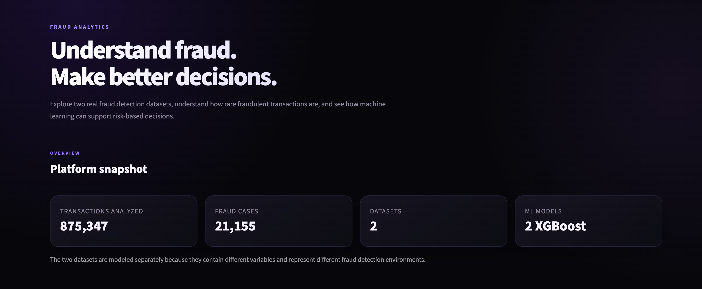
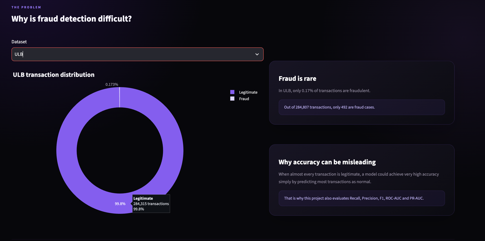
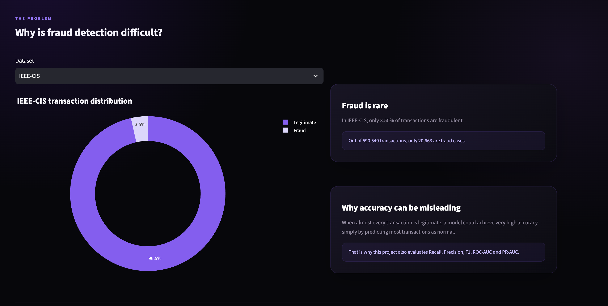
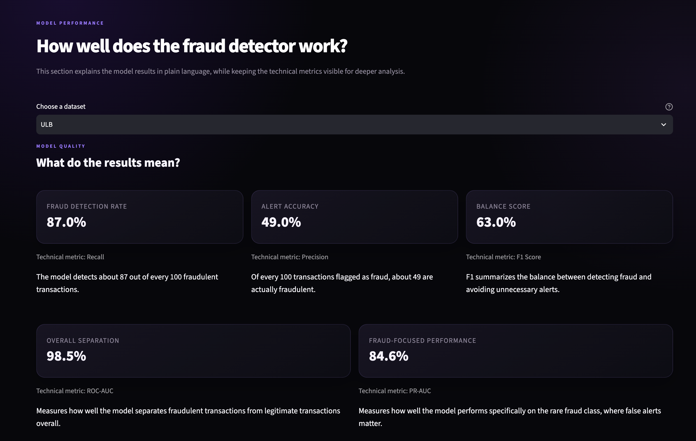
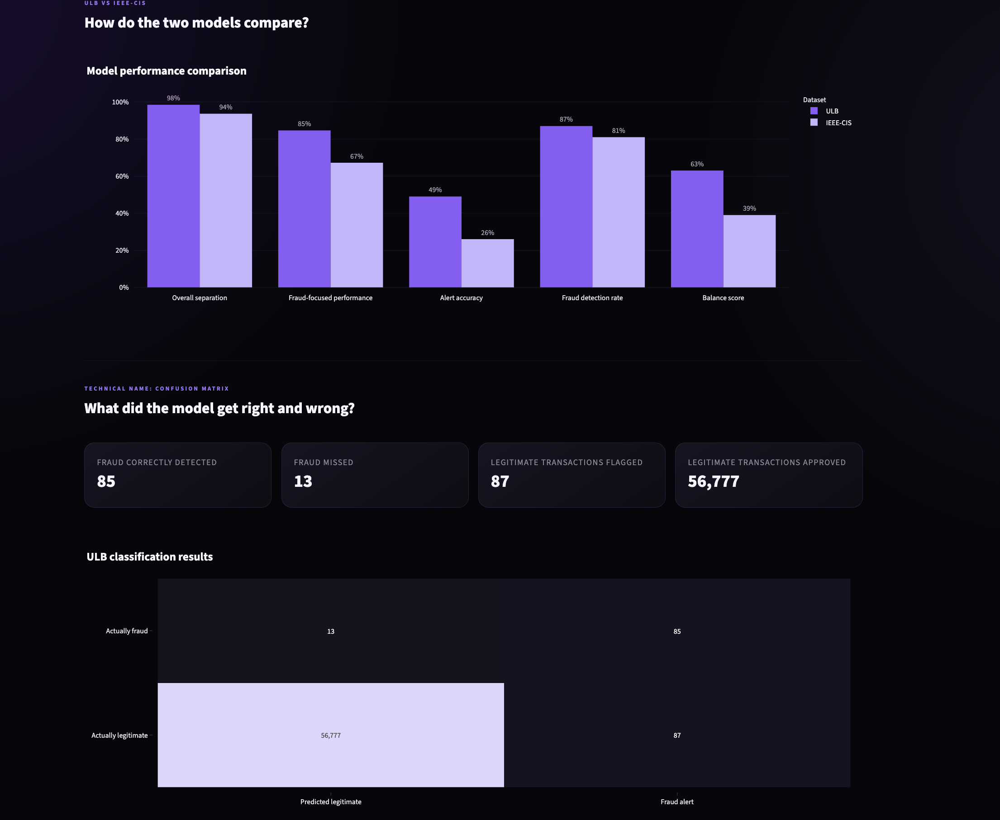
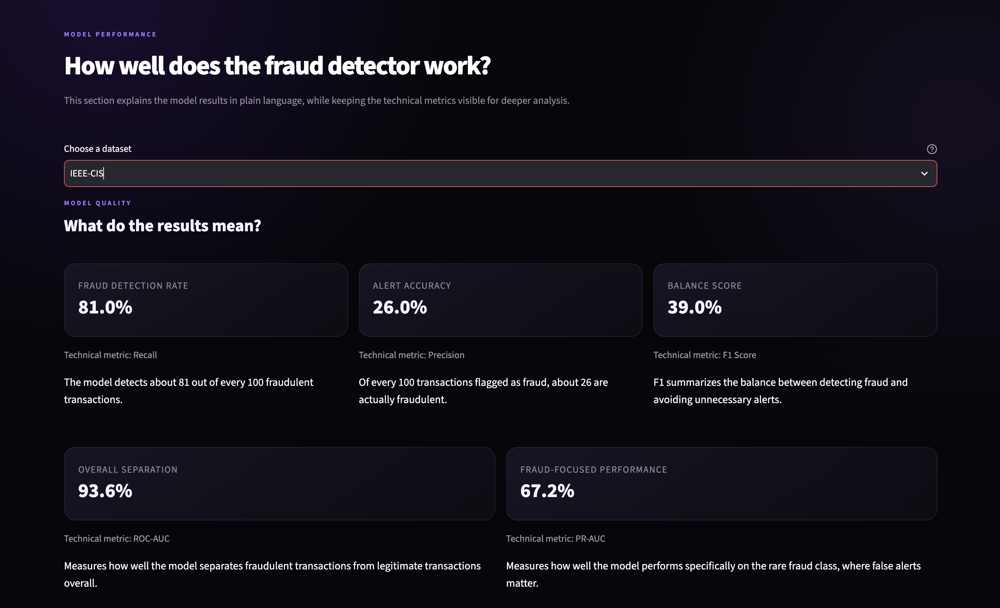
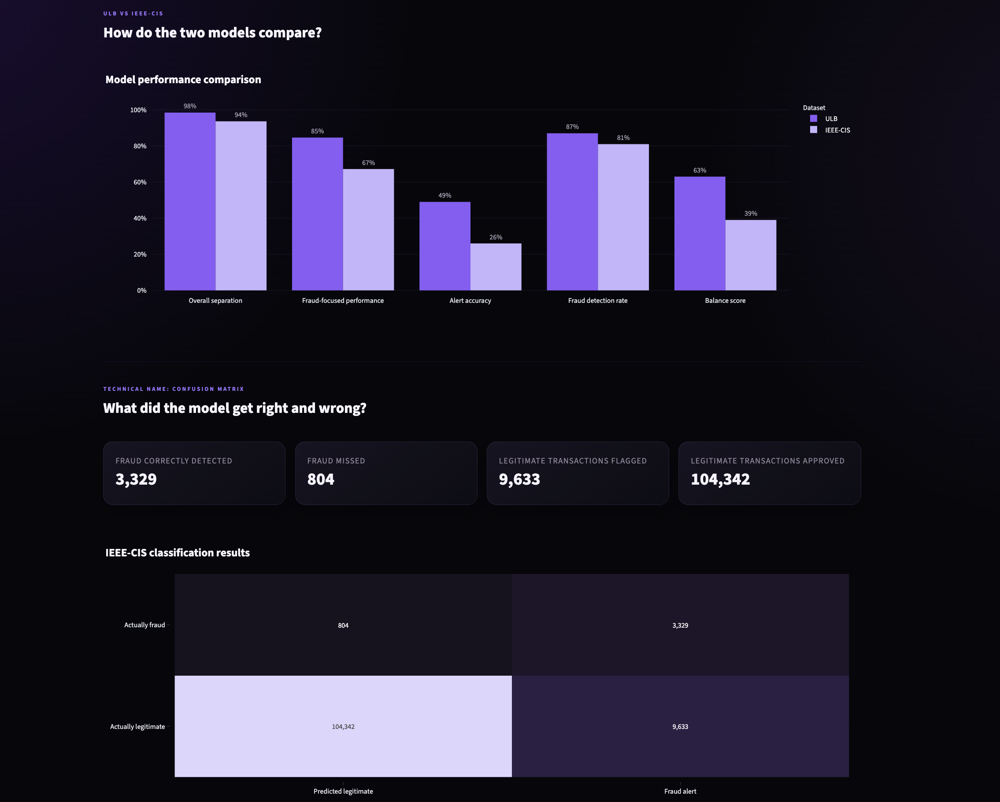
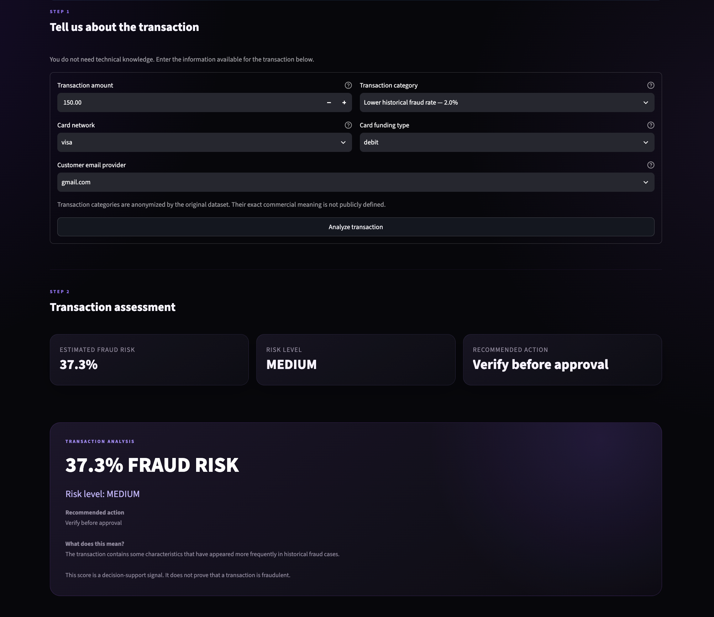

# Fraud Detection Platform

End-to-end Machine Learning project for detecting fraudulent financial transactions using two real-world datasets, XGBoost models and an interactive Streamlit dashboard.

The project explores highly imbalanced fraud data, compares model performance and translates model predictions into understandable risk decisions.



---

## Project Overview

This project implements two independent fraud detection pipelines:

- **ULB Credit Card Fraud Detection**
- **IEEE-CIS Fraud Detection**

Both datasets are analyzed and modeled separately because they contain different features and represent different fraud environments.

The project covers the workflow from exploratory data analysis to an interactive fraud detection application:

- Exploratory Data Analysis
- Data preprocessing
- Imbalanced classification
- XGBoost modeling
- Model evaluation
- Threshold analysis
- MLflow experiment tracking
- Interactive risk simulation
- Streamlit analytics dashboard

---

## Fraud Analysis

Fraud detection is a highly imbalanced classification problem.

The two datasets show very different fraud environments:

| Dataset | Transactions | Fraud Cases | Fraud Rate |
|---|---:|---:|---:|
| **ULB** | 284,807 | 492 | 0.17% |
| **IEEE-CIS** | 590,540 | 20,663 | 3.50% |

This imbalance is one of the main reasons why metrics such as Precision, Recall, F1 and PR-AUC are more informative than accuracy alone.

### ULB Fraud Distribution



### IEEE-CIS Fraud Distribution



---

## Model Performance

Both fraud detection pipelines use **XGBoost**, but each model is trained independently.

| Dataset | ROC-AUC | PR-AUC | Precision | Recall | F1 |
|---|---:|---:|---:|---:|---:|
| **ULB** | 98.47% | 84.64% | 49% | 87% | 63% |
| **IEEE-CIS** | 93.64% | 67.21% | 26% | 81% | 39% |

### What do these metrics mean?

**Recall — Fraud Detection Rate**  
Of all transactions that were actually fraudulent, how many did the model detect?

**Precision — Alert Accuracy**  
Of all transactions flagged as fraud, how many were actually fraudulent?

**F1 Score — Balance Score**  
Balances fraud detection and alert accuracy in a single metric.

**ROC-AUC — Overall Separation**  
Measures how well the model distinguishes fraudulent transactions from legitimate ones.

**PR-AUC — Fraud-Focused Performance**  
Evaluates the relationship between detecting fraud and avoiding false alerts. It is particularly useful for highly imbalanced datasets.

---

### ULB Model Performance





---

### IEEE-CIS Model Performance





---

## Interactive Risk Simulator

The Streamlit application includes an interactive fraud risk simulator.

Users can enter transaction information and receive:

- Estimated fraud probability
- Risk level
- Recommended action

The simulator uses a simplified XGBoost inference pipeline trained with selected IEEE-CIS transaction features.



The probability is translated into three understandable risk levels:

| Risk Level | Model Probability | Suggested Action |
|---|---:|---|
| **Low** | 0% – 29% | Approve normally |
| **Medium** | 30% – 69% | Verify before approval |
| **High** | 70% – 100% | Manual review |

The risk score is designed as a decision-support signal rather than proof that a transaction is fraudulent.

---

## Model Decision Strategy

Fraud detection involves a trade-off.

A more sensitive model can detect more fraud, but it may also flag more legitimate customers. A stricter decision threshold reduces false alerts but may allow more fraud to go undetected.

The dashboard allows this trade-off to be explored through different detection strategies:

- **High fraud protection**
- **Balanced protection**
- **Lower customer friction**

This makes model evaluation easier to connect with real business decisions.

---

## Tech Stack

**Machine Learning**

`Python` · `Pandas` · `NumPy` · `Scikit-learn` · `XGBoost`

**Experimentation & Evaluation**

`MLflow` · `ROC-AUC` · `PR-AUC` · `Precision` · `Recall` · `F1`

**Visualization**

`Streamlit` · `Plotly` · `Matplotlib`

**Development**

`Jupyter Notebook` · `Git` · `GitHub`

---

## Project Structure

```text
fraud-detection-platform/
├── assets/
│
├── dashboard/
│   ├── views/
│   ├── app.py
│   ├── components.py
│   ├── config.py
│   ├── data.py
│   └── styles.py
│
├── models/
│   ├── dashboard_risk_model.pkl
│   ├── ieee_xgb_model.pkl
│   └── ulb_xgb_model.pkl
│
├── notebooks/
│   ├── ieee/
│   │   ├── 03_eda_ieee.ipynb
│   │   └── 04_model_ieee.ipynb
│   │
│   ├── ulb/
│   │   ├── 01_eda_ulb.ipynb
│   │   └── 02_model_ulb.ipynb
│   │
│   ├── 05_comparison.ipynb
│   └── 06_final_demo.ipynb
│
├── src/
│   └── train_dashboard_model.py
│
├── requirements.txt
└── README.md
```

---

## Datasets

The original datasets are not included in the repository because of their size.

### ULB Credit Card Fraud Detection

Place:

```text
creditcard.csv
```

inside:

```text
data/raw/ulb/
```

### IEEE-CIS Fraud Detection

Place:

```text
train_transaction.csv
train_identity.csv
```

inside:

```text
data/raw/ieee/
```

Both datasets are publicly available through Kaggle.

---

## Run Locally

Clone the repository:

```bash
git clone https://github.com/Eroscardenas/fraud-detection-platform.git
cd fraud-detection-platform
```

Install the dependencies:

```bash
pip install -r requirements.txt
```

Run the Streamlit application:

```bash
python -m streamlit run dashboard/app.py
```

---

## Key Takeaway

Fraud detection is not simply about maximizing accuracy.

A useful fraud detection system must balance:

**fraud detected · fraud missed · legitimate transactions incorrectly flagged**

This project demonstrates that trade-off across two different fraud environments and translates Machine Learning results into understandable risk decisions.